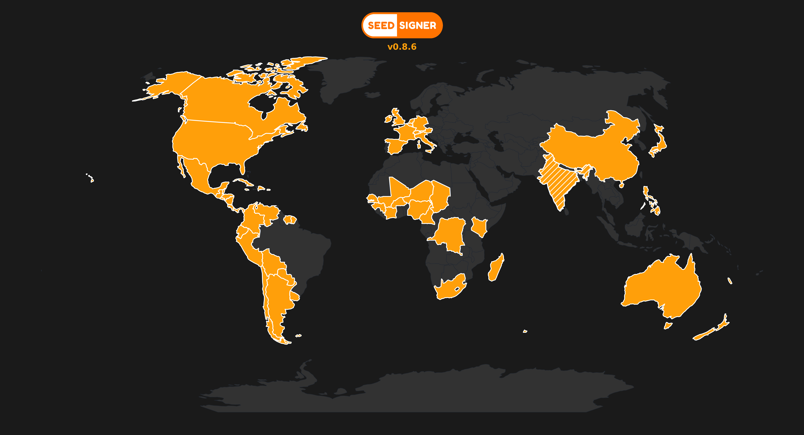

# SeedSigner-WorldMap



SeedSigner-WorldMap is a Python tool to generate a beautiful, dark-themed world map that highlights all countries whose official languages are currently supported by the latest SeedSigner release.

- Highlighted countries (solid orange): Countries where at least one official language is fully supported by SeedSigner.
- Diagonally patterned countries: Countries with partial (not full) language support in SeedSigner (e.g., India, where not all official languages are supported).
- Custom logo overlay
- High-quality PNG and SVG output
- Displays the current release code/version on the map, just below the logo, using the same color as highlighted countries. You can set the release code by editing the RELEASE_CODE variable at the top of generate_map.py.

## Features
- Highlight countries by listing them in `highlighted_countries.txt` (should match SeedSigner full language support)
- Mark partially supported countries by listing them in `partially_supported_countries.txt`
- Add your own logo (PNG) to the top of the map
- Output is suitable for web or print

## Setup
1. Clone this repository and navigate to the project directory.
2. Create a virtual environment and install dependencies:
   ```sh
   python3 -m venv .venv
   source .venv/bin/activate
   pip install -r requirements.txt
   ```
3. Download the Natural Earth shapefile (Admin 0 – Countries) and place it in a `data/` folder as `ne_110m_admin_0_countries.shp` (and related files).

## Usage
1. Edit `highlighted_countries.txt` to list countries to highlight (one per line, use exact names from the shapefile). This list should correspond to all countries whose official languages are fully supported by the latest SeedSigner release. See below for details.
2. Edit `partially_supported_countries.txt` to list countries with partial language support (one per line).
3. Place your logo as `logo.png` in the project directory (optional).
4. Run the script:
   ```sh
   python src/generate_map.py
   ```
5. The output files `output/world_map.png` and `output/world_map.svg` will be created in the output directory.

## How to Update for New SeedSigner Releases
- Check the SeedSigner documentation or release notes for the list of supported languages.
- For each supported language, determine the countries where it is an official language.
- Update `highlighted_countries.txt` to include all such countries (use exact names from the shapefile; see `supported_countries.txt` for reference).
- For countries with only partial language support, add them to `partially_supported_countries.txt`.

## Customization
- Change colors or hatch style in `generate_map.py`.
- Add or remove countries from the text files as needed.

## License
MIT License 